# Go gRPC Ecommerce - Pt 1 - React


In this 3 articles series I will show you how to use gRPC to create an ecommerce with frontend in React and Backend in GO.

We will use React, Typescript, Keycloak, gRPC, Protocol Buffer, Docker Compose, MongoDB e Go!

# Part 1 - Frontend

Site running\*: http://go-grpc-ecomm-react.s3-website-us-east-1.amazonaws.com/

- without Red Hat's Keycloak

In this article I will not go step by step creating each file, but I will try to comment on each file to make it simple to understand. The goal is to have only the starting point for the next articles, which will use this website as frontend with a backend in Go with gRPC. In the third article we will go back to this site and make the integration.

Run the commands below to download the code and run the site. See the `keycloak` section below to configure and run the Red Hat's Keycloak using the docker and be able to checkout.

`git clone https://github.com/gugazimmermann/go-grpc-ecomm-react.git`

`cd go-grpc-ecomm-react`

`npm install`

`npm start`

## Eslint and Prettier

These two will help to keep the code formated and help to avoid errors.

`npm install --save-dev eslint @typescript-eslint/parser @typescript-eslint/eslint-plugin prettier eslint-config-prettier eslint-plugin-prettier husky@4 pretty-quick lint-staged`

`.eslintrc.js`: this is the configuration file to Eslint, where we'll tell to use typescript, react and prettier.

`.prettierrc.js`: the Prettier config.

`package.json`: We will chage to be able to run `npm run lint` and `npm run prettier`, and also make husky run lint and prettier everytime we do a `git commit`, this way we can guarantee that the code will be pushed in the right format.

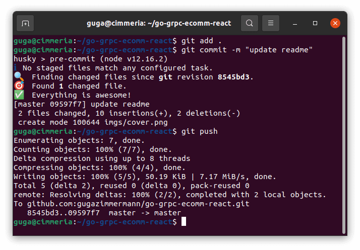

## Store Sample Data

All the products images: https://github.com/gugazimmermann/go-grpc-ecomm-react/tree/master/src/imgs

The Products and Categories sample data: https://github.com/gugazimmermann/go-grpc-ecomm-react/blob/master/src/utils/sample-data.ts

This will be your database for now, after we have the GO backend this will change.

## CSS

I'm not a designer, so to help in this project I'll use bootstrap and create a very simple layout.

`npm install react-bootstrap bootstrap node-sass`

In `public/index.html` we need to add the Bootstrap CSS.

```html
<link
  rel="stylesheet"
  href="https://cdn.jsdelivr.net/npm/bootstrap@4.6.0/dist/css/bootstrap.min.css"
  integrity="sha384-B0vP5xmATw1+K9KRQjQERJvTumQW0nPEzvF6L/Z6nronJ3oUOFUFpCjEUQouq2+l"
  crossorigin="anonymous"
/>
```

And in `src/css/` just 3 files:

- `_colors.scss`: The custom colors of the page. Fell free to change to the colors you like.
- `src/css/app.scss`: This file will import the custom colors and define your custon bootstrap theme.
- `src/css/layout.scss`: And this last file will have some css classes to adjust your page.

## Layout

In `src/App.tsx` we put the routes right bellow the layout to not have to add the layout to each page. The each page will be a child of the layout.

- `src/layout/index.tsx` is the entry point of the layout, will load the css and add the header and the footer.

- `src/layout/footer.tsx` a very simple file created just to show the credits, like who made the page and the icons that was used.

- `src/layout/header.tsx` will show the logo, the page name (from the `.env` file) and the description. The header also load the menu of the page.

- `src/layout/menu.tsx` This top menu will show the page logo, title, the categories, a search fied and the cart button.

## Router

`npm install react-router-dom react-error-boundary && npm install --save-dev @types/react-router-dom`

`src/index.tsx` we added the main Router and use the browser history.

`src/App.tsx`

First we add the ErrorBoundary and create a fallback, this will take care if some route fail to load. Suspense are added to work with Lazy, this make react load just the components that we need at the time.

This page will have very simple routes, just Category, Cart and a Not Found page if the user type a url that do not exists.

## Constants

- `src/constants/index.ts`

It's good to have constants to avoid any typing errors or / and when we have to use the value repeatedly. In our page we will use the constants for the routes, state and toast.

## Interfaces

- `src/interfaces/index.ts`

In typescript we need Interfaces for type checking, and in this file we are going to centralize them so that we don't have to repeating every time they are used. I like to put a `I` in front of the name to easily know that I'm dealing with an interface.

## API and SERVER

- `src/api/index.ts`

It will make calls to the backend server. It is good to leave it separate so we do not need to look all the frontend code when we move to the GO server.

- `src/utils/server.ts`

In this file we are going to simulate our backend server. We will receive calls from the API and respond with the data that we have in `src/utils/sample-data.ts`.

## Handling the page state

- `src/context/index.tsx`

This file will create the context and provider for the state.

- `src/context/reducers.ts`

Here we will have the reducers for the state, so the state can only be changed if done by a dispatch.

For our website we will only have to add, update and remove products from the cart, checkout, login and logout. We will also control to have a Toast appear whenever something is changed in the cart.

To use the state on the entire site we will put the provider in `src/App.tsx`, just above the layout, so on the pages that we are going to use it just need to use the context.

## Pages

- `src/pages/not-found.tsx`

Very simple page, it only shows an alert when the user tries to use a Route that does not exist.

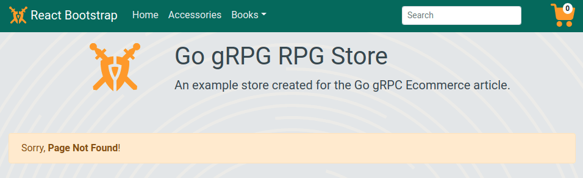

- `src/pages/category.tsx`

This page is practically the whole site, we will practically use just this page, so each time it is called we will reset the information.

When this page is called the first thing we need to do is see if it has a search, then if we are on the homepage, and finally if is to show some category, so we can make the correct call to the server to obtain the products.

Then we will show the Breadcrumb, which can again be for search, homepage or categories. And if we are in a subcategory, we should show the parents.

If we were in a category, we should check the subcategories and creating a sidemenu with them.

We will also show the products, and to not get a long list we will add a pagination and the user can choose how many products he wants to see.

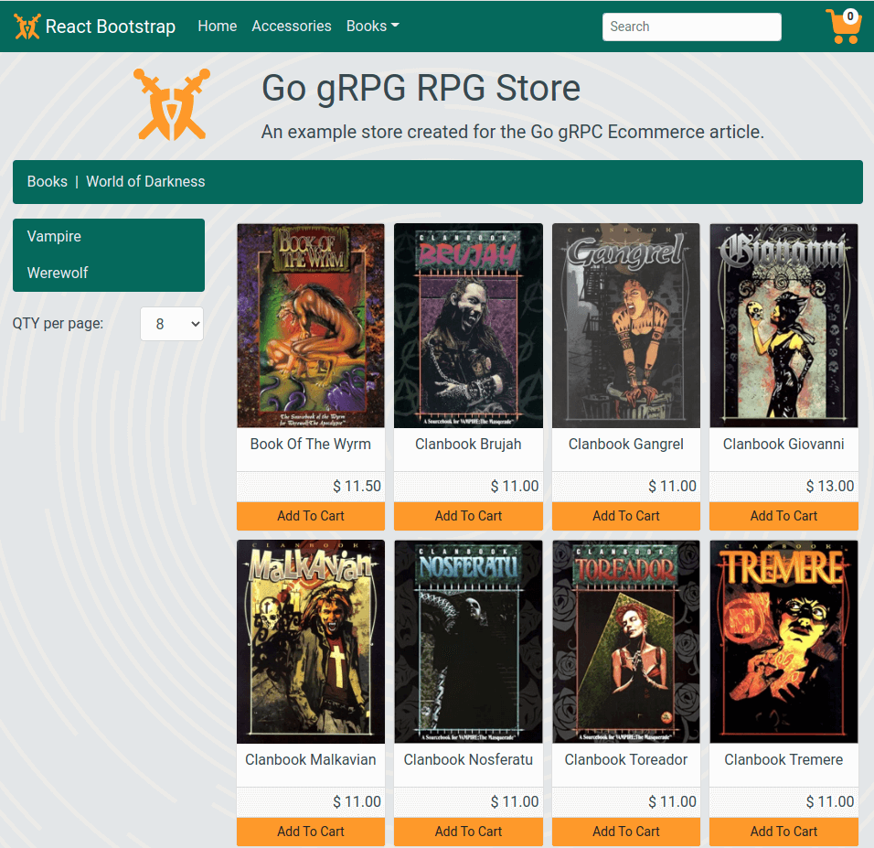

- `src/pages/cart.tsx`

This page will show the products that the user has added to the cart and allow it to change the quantity or remove it from the cart. Will also show if the user is logged with the Keycloak or not, and allow them to login / logout and checkout.


## Components

- `src/components/menu-nav.tsx`

The Menu navigation by categories. We will receive from the server the main categories (which do not have a parent) and for each their direct subcategories (only 1 level), and then set up the list and dropdowns.

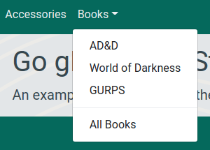

- `src/components/menu-cart.tsx`

The button for the shopping cart. We will use the state to show a badge with the quantity of products added to the cart, and we will also show a Toast whenever a product is added, updated or removed from the cart.

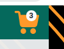

- `src/components/breadcrumb.tsx`

It will show a title if we are on the homepage, or the search term and the number of results, or the category and the parents categories.

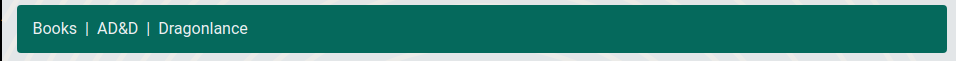

- `src/components/side-menu.tsx`

If you are viewing a category it will show the subcategories.

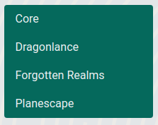

- `src/components/qty-per-page.tsx`

Allows the user to define how many products to see at a time.

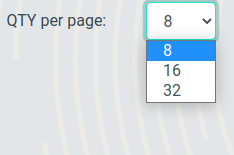

- `src/components/product-card.tsx`

Shows the image, title and value of the product to the user, also allows the user to add the product to the cart.

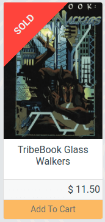

- `src/components/pagination.tsx`

To not to show a very long list of products we will use pagination, this file create a list of page numbers for the user be able to browse the product list.

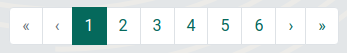

- `src/components/cart-list.tsx`

Shows the list of products in the cart and the total purchase price.

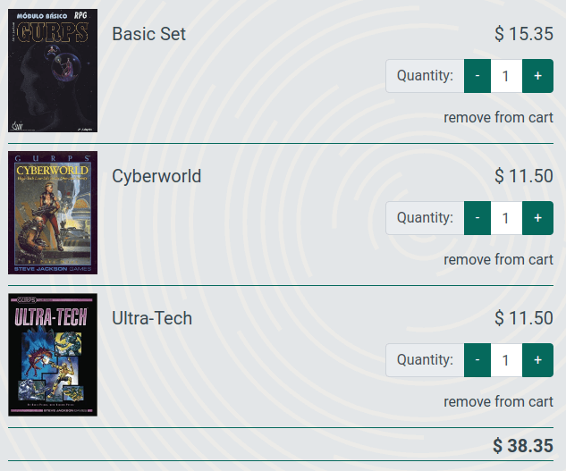

- `src/components/cart-item.tsx`

Shows the product in the cart list and allows the user to change the quantity or remove it from the list.

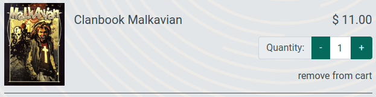

- `src/components/login-form.tsx`

Allows the user to login using the Red Hat's Keycloak.

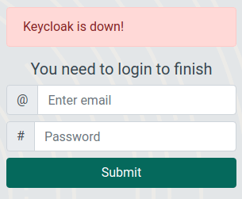

- `src/components/logged-in.tsx`

When the user is logged in, it shows the user's information and allows him to logout or checkout the products in the cart.

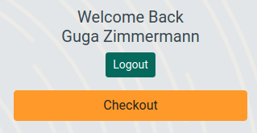

# Red Hat's Keycloak


`docker-compose.yml`

To handle user authentication we will use Red Hat's Keycloak. To use it you need to have the docker and docker compose installed (in my previous articles I show you how to install). To start you only need to run: `docker-compose up` and then open it in the browser

http://localhost:8080/auth/admin
user: admin
pass: admin

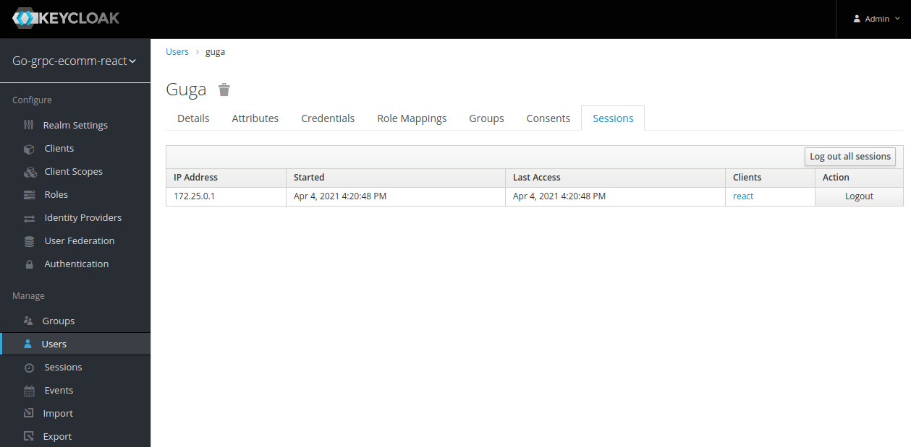

Pass the mouse over `Master` and add a realm `go-grpc-ecomm-react`. Create a user, set `User Enabled` and `Email Verified` than go to the user `Credentials` and set a password and change temporary to off.

Open http://localhost:8080/auth/realms/go-grpc-ecomm-react/account and click sign-in to test the new user. After login go back to admin console and go to sessions, you will see `account-console` with 1 active session. Click `account-console` and show sessions to see the user.

Click on `Clients` -> `create` and create a client with id `react`, change `Access Type` to `confidential`, set `Standard Flow Enabled` to off, `Direct Access Grants Enabled` to on. Save and go to `Credentials` to see the Secret (change the value of `REACT_APP_KEYCLOAK_CLIENT_SECRET` in `.env` to this secret). Now set `Access Type` back to `public` (you will not see the `Credentials` tab anymore) and add `http://localhost:3000` in `Web Origins`. This will handle CORS problems.

Try to run `http://localhost:8080/auth/realms/go-grpc-ecomm-react/.well-known/openid-configuration` to see if everything is ok. It will open a JSON with many endpoints, we will use the `token_endpoint` now.

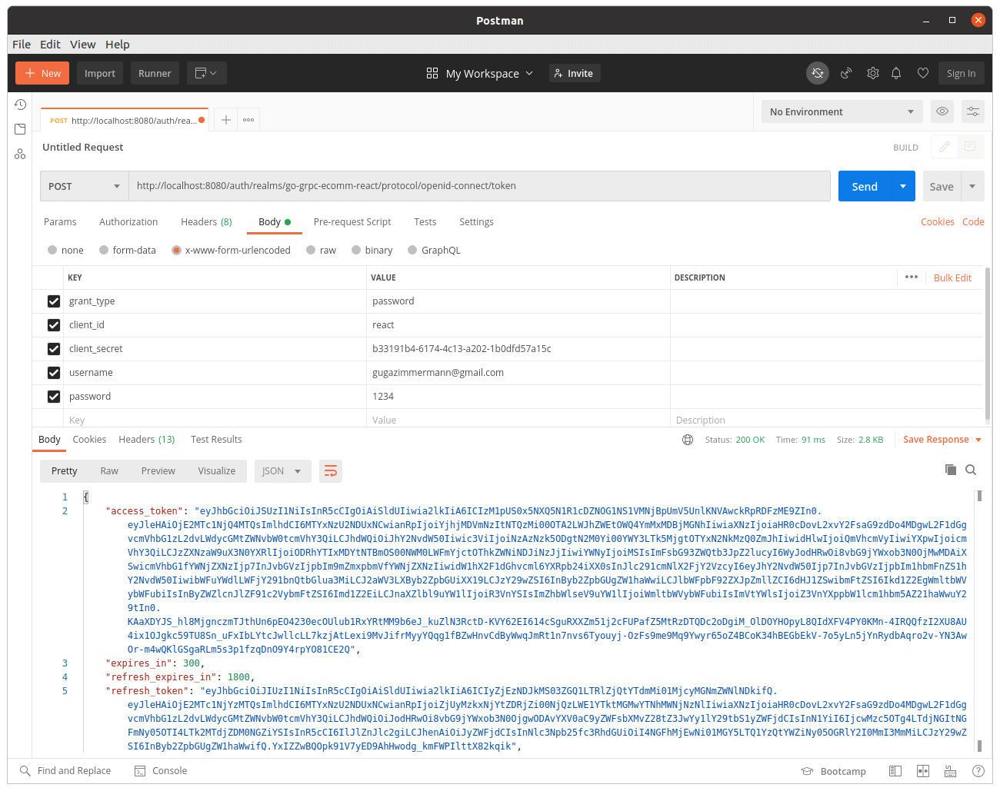

You can try to login using POSTMAN (https://www.postman.com). Send a POST to `http://localhost:8080/auth/realms/go-grpc-ecomm-react/protocol/openid-connect/token` In Body select `x-www-form-urlencoded` and

```
grant_type : password
client_id : react
client_secret : the client secret from client`s credentials
username : the email of the user you just created
password : the password of the user you just created
```

Hit send and you will receive a JSON like this one:

```json
{
  "access_token": "eyJhbG...",
  "expires_in": 300,
  "refresh_expires_in": 1800,
  "refresh_token": "eyJhbG...",
  "token_type": "Bearer",
  "not-before-policy": 1617433028,
  "session_state": "41252d19-fa5b-4c33-a354-a86e637685ac",
  "scope": "profile email"
}
```

If you go to the keycload admin console and click `Users -> the user id -> Sessions` will show the login info and your keycloak is working.

## Credits

The icons used in this project are from www.flaticon.com
